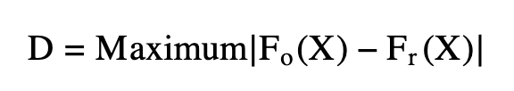

Pull out residuals
Pick a paper that uses KS test

We can use the <b>Kolmorgorov-Smirnov Test</b> as a way to reject null hypotheses. By using this statistical method we are aiming to prove that the two data sets we are working with do not come from the same distribution.

The most common way to reject the null is with a student's t-test, however, this can only be accurately used when we know our data set is <b>normal</b>. If we are using data that we aren't sure about, or know isn't of a normal distribution it can be trickier to reject this hypothesis. That's where the Kolmorgorov-Smirnov Test comes into play. The most important time to think about using this test is when you have a very large data set (n &ge; 50) as opposed to the Shapiro-Wilks test which is better for smaller data sets. 

If we are running a one-sample K-S Test, our null is that the sample comes from the same distribution as the data set we are comparing it with.

If we are running a two-sample K-S Test, our null is that both samples come from the same distribution. 

So why is it important to disprove the null?
Failing to reject a null hypothesis means there is no sufficient evidence for the expected or the observed results we see in our studies.

## Equation ##



<b>F<sub>0</sub>(x)</b> = the total observed frequency distribution of a random sample

<b>F<sub>0</sub>(x) = <sup>k</sup>&frasl;<sub>n</sub></b> where k = the number of observations and n is the total number of observations

<b>F<sub>r</sub>(x)</b> = the theoretical frequency distribution

<b>D</b> = the critical value between 0 and 1 indicating the magnitude of the observed difference in distributions. Values closer to 1 indicate high likeness, while values closer to 0 indicate difference. Unlike a p-value which has a set threshold for whether something is significant or not--although this is also not necessarily the be-all-end-all of significance!--the D value produced from the K-S test is relative to each individual distribution. <b>Different data sets will produce different D values!</b>

If the calculated value is <b>less</b> than the critical value <b>D</b> we must <b>accept the null hypothesis</b>

If the calculated value is <b>greater</b> than the critical value we can <b> reject the null hypothesis</b>


```{r setup, include=FALSE}
#First, let's make a data set with a normal distribution to use as a comparison later on. Remember, we want a large data set in order to run this test effectively.
#sample_one <- rnorm(200, mean = 50, sd = 2) #making an arbitrary data set with the rnorm function to ensure normalcy
#head(sample_one) #first 6 rows of our new data set
#hist(sample_one) #visualizing the normal distribution with a histogram
```

```{r 1, include=FALSE}
#sample_two <- rpois(200, 15) #using rpois() to randomize a large data set, keeping our size the same for simplicity
#head(sample_two)
#hist(sample_two)
```

### One-Sample Test ###
Let's do an example!
Say we are zoologists studying turtles. We want to conduct an experiment to see if different species of turtle prefer to eat cucumbers or lettuce when presented with both. We are going to use 5 different species and count how many turtles go for each food choice first in each population (n = 150).
```{r 2, include=TRUE}
# create matrix with 5 columns and 2 rows
data <- matrix(c(16, 25, 17, 8, 11, 14, 5, 13, 22, 19), nrow = 2, ncol = 5, byrow = TRUE)
# specify the column names and row names of matrix
colnames(data) <- c('A.marmorata ','C.fimbriata ','C.picta ','C.flavomarginata ', 'C.amboinensis')
rownames(data) <-  c('Cucumber','Lettuce')
# assign to table
final = as.table(data)
# display
final
```
<b>H<sub>0</sub></b> = There is no difference among turtle species with respect to their choice of cucumber over lettuce.

<b>H<sub>1</sub></b> = There is a difference among turtle species with respect to their choice of cucumber over lettuce

Let's say we predict 18 turtles from each species choose cucumber and make a new table with our prediction.

```{r 4, include=TRUE}
#appending our original table
final_new <- final 
#assigning a new row name and filling in the data using the list function
final_new <- rbind(final_new, 'Predictions' = list(18, 18, 18, 18, 18)) 
#ready to print!
final_new
```
```{r 5, include=TRUE}
library(MASS)
calculations <- matrix(c(16, 18, '16/150', '18/150', '2/150', 25, 18, '41/150', '36/150', '5/150', 17, 18, '58/150', '54/150', '4/150', 8, 18, '66/150', '72/150', '6/150', 11, 18, '77/150', '90/150', '13/150'), nrow = 5, ncol = 5, byrow = TRUE)
colnames(calculations) <- c('Observed ','Predictions ','F0(X)', 'Fr(X)', '|F0(X) -Fr(X)|')
rownames(calculations) <-  c('A.marmorata ','C.fimbriata ','C.picta ','C.flavomarginata ', 'C.amboinensis')
table = as.table(calculations)
table
```


